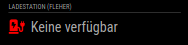

# Module: Puppeteer evaluations (MMM-PuppeteerChecker)

This is a module for <a href="https://github.com/MichMich/MagicMirror">MagicMirror</a>.

`MMM-PuppeteerChecker` will periodically executes a puppeteer function and evaluates the result.

See https://www.npmjs.com/package/puppeteer for details. Use Headless Recorder to record flows https://chrome.google.com/webstore/detail/headless-recorder/djeegiggegleadkkbgopoonhjimgehda?hl=de

Based on https://github.com/shbatm/MMM-JSONStatusChecker

### Screenshot



## Installation

1. Navigate to your MagicMirror `modules` directory.
2. Execute `git clone https://github.com/pelzerim/MMM-PuppeteerChecker`.
3. Add the module to your MagicMirror's `config.js` file (see next section).

## Using the Module

To use this module, add it to the modules array in the `config/config.js` file:

Required parameters: check & puppeteer

```javascript
modules: [
    ...,
    {
			module: "MMM-PuppeteerChecker",
			position: "bottom_left", // This can be any of the regions.
			header: "Ladestation (Fleher Str)",
			config: {
				name: "LadestationKichererbse", // no spaces!
        updateInterval: 600000,
        trueString: "{{RESULT}} verfügbar", // Replaces {{RESULT}} with puppeteer return value
        falseString: "Keine verfügbar", // Replaces {{RESULT}} with puppeteer return value
        icon: "charging-station", // font awesome
				check: (data) => data > 0, // data is return value of puppeteer() function
				puppeteer: async (browser) => { // needs to be async
					const page = await browser.newPage()

					// Your puppeteer code....

					const data = await page.evaluate(() => document.querySelectorAll('#data')[0].textContent);
					return Number(data) // Return your result
				}
			}
		},
    ...
]
```

## License

Based on https://github.com/shbatm/MMM-JSONStatusChecker

MMM-PuppeteerChecker is licensed under the MIT License.
